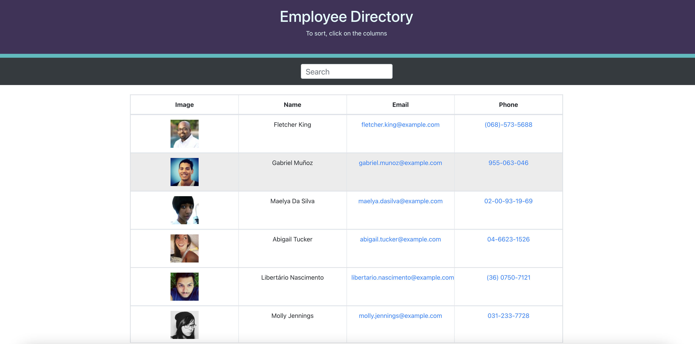

# employee_directory

## Description

This react application is a employee directory that allows the user to sort through the employees provides by the randomuser.me API.

## Installation
To install this application run npm install in your terminal.

## Usage
-Clone/fork repo and install the necessary dependencies. Run the server with npm start and view application in your browser at http://localhost:3000.
-View deployed app on GitHub Pages.

## Application 